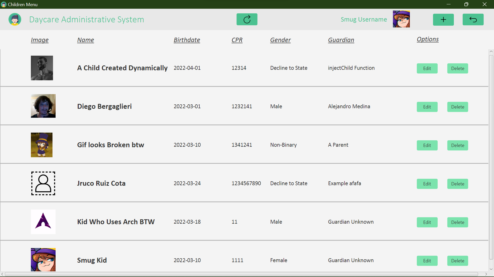
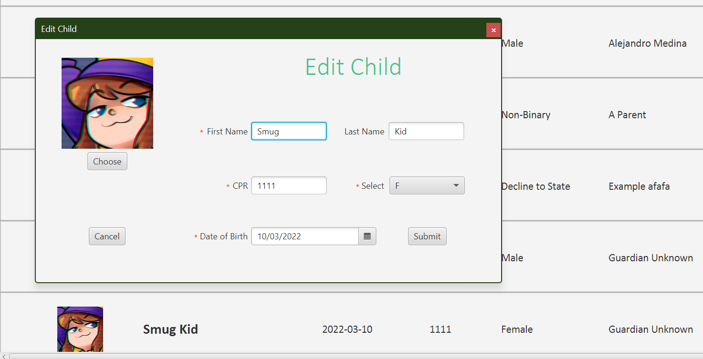
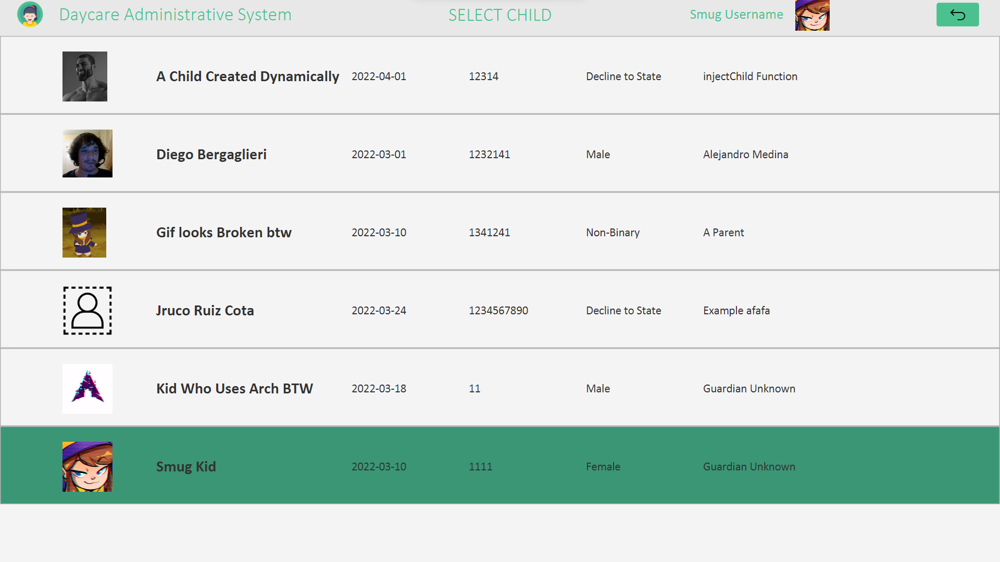

# Roskilde Daycare Centre Administrative System

## Project description
Administrative System mini-project at KEA DAT21i. This is a full-stack JavaFX native program which aspires to satisfy the administrative needs of a Daycare Centre in Denmark. As per the [project requirements](Project%20Report/Daycare_Project.pdf), the application should be capable of displaying and storing information from and in a database, whilst simultaneously being intuitive and easy to use by means of a user interface.

Use cases of this application include but are not limited to:
* Viewing children, guardians, staff members and phone numbers stored in the database
* Adding children, guardians and staff members with all of their particulars.
* Editing children, guardians and staff members with all of their particulars.

The application turned out quite well, but there are some issues and edge scenarios that have not been fixed yet. Moreover, making programs fully responsive with JavaFX is a very time-consuming task, meaning that the UI has been "hard-coded" to look good for a specific screen size, and going above or below that will result in the GUI not looking as intended. The aforementioned does not hinder usage, but it does have a significant aestethic impact.

As "a picture speaks more than a thousand words", here are some images of the GUI:

Authentication Window

 

Main Menu

 

Children Menu. Each instance is generated dynamically from the database.
Guardian and Staff menu look very similar; only the data and fields contained therein varies.

 

Edit Child "Pop-Up" Window. Add child is the same but with empty fields and a placeholder image

 

Confirmation "Pop-Up" upon pressing "Delete" on an instance. (Image varies for same instance because it's a GIF file)

 

Creating a new guardian. Children and Guardians are linked by means of the "Select Child" button. The "Child ID" field is unmodifiable otherwise.

 

"Pop-Up" where we are selecting "Smug Kid" child to link with new parent from last view. Mouse is hovering over the last instance.

 

Staff Edition Window. If desired, "username" and "password" can be filled in or erased to provide or revoke access to the system.
Likewise, "Admin" can be selected or de-selected to grant or revoke access to the "Staff" Menu.

 
 

Features that should be implemented in the future should be but are not limited to:
* Platform independent file management (image selection only works on my machine)
* Script to generate the required local database as the application does not use a remote server for the back-end.
* Source code clean-up
* Edge case scenarios where program does not function as intended should be fixed. E.G. Re-opening the edit view for an instance after initial edit won't show the latest changes without manual refresh.

[Image Attributions](src/main/resources/com/main/daycare_administrative_system/assets/LICENSE-DISCLAIMER.txt)